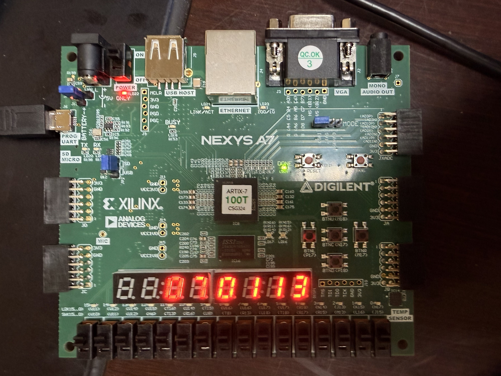

# Digital Clock - Nexys A7 FPGA Project

A digital clock implementation for the Nexys A7-100T FPGA development board using VHDL. This project displays time in HH:MM:SS format on the 7-segment display with button controls for time setting.



## Features

- **Real-time Clock Display**: Displays hours (00-23), minutes (00-59), and seconds (00-59) on the 7-segment display
- **Time Setting Controls**: Three buttons for clock control:
  - **Reset Button (btnRst)**: Resets the clock to 00:00:00
  - **Select Button (btnSel)**: Cycles through selection modes (None → Hours → Minutes → None)
  - **Increment Button (btnInc)**: Increments the selected time component (hours or minutes)
- **Multiplexed Display**: Uses time-multiplexed 7-segment display for efficient resource usage
- **100 MHz Clock**: Uses the board's 100 MHz system clock with frequency division for 1-second ticks

## Hardware Requirements

- **FPGA Board**: Digilent Nexys A7-100T
- **Development Software**: Xilinx Vivado (tested with recent versions) - This project was compiled and tested using Vivado
- **USB Cable**: For programming the FPGA board

## Project Structure

This repository contains the source files needed to build the project:

```
Clock/
├── src/
│   └── clock.vhdl          # Main VHDL source file
├── Nexys-A7-100T-Master.xdc # Pin constraints file
└── README.md
```

**Note**: The Vivado project folder is not included in this repository as it was too large for GitHub. You will need to create a new Vivado project using the source files provided.

## Pin Assignments

The project uses the following Nexys A7 board resources:

### Clock Input
- **clk**: 100 MHz system clock (Pin E3)

### Buttons
- **btnRst**: Reset button - Button Left (Pin P17)
- **btnSel**: Select button - Button Center (Pin N17)
- **btnInc**: Increment button - Button Right (Pin M17)

### 7-Segment Display
- **seg[6:0]**: 7-segment segment signals (CA through CG)
  - seg[0] - CA (Pin T10)
  - seg[1] - CB (Pin R10)
  - seg[2] - CC (Pin K16)
  - seg[3] - CD (Pin K13)
  - seg[4] - CE (Pin P15)
  - seg[5] - CF (Pin T11)
  - seg[6] - CG (Pin L18)

- **an[7:0]**: Anode control signals (active low)
  - an[0] - AN0 (Pin J17) - Hours tens
  - an[1] - AN1 (Pin J18) - Hours ones
  - an[2] - AN2 (Pin T9)  - Minutes tens
  - an[3] - AN3 (Pin J14) - Minutes ones
  - an[4] - AN4 (Pin P14) - Seconds tens
  - an[5] - AN5 (Pin T14) - Seconds ones
  - an[6] - AN6 (Pin K2)  - Unused
  - an[7] - AN7 (Pin U13) - Unused

## Building the Project

This project was compiled and tested using Xilinx Vivado. The Vivado project folder is not included in this repository due to its large size, so you'll need to create a new project using the provided source files.

### Creating a New Vivado Project

1. **Create Project**:
   - Launch Vivado
   - Click "Create Project" and follow the wizard
   - Select "RTL Project" as the project type
   - Add `src/clock.vhdl` as a source file
   - Select "Nexys A7-100T" as the target board (or add `Nexys-A7-100T-Master.xdc` as a constraints file if the board isn't in the list)

2. **Add Constraints**:
   - Add the constraint file: `Nexys-A7-100T-Master.xdc`
   - Verify that the port names in the constraint file match your VHDL entity ports

3. **Generate Bitstream**:
   - Click "Generate Bitstream" in the Flow Navigator
   - Wait for synthesis, implementation, and bitstream generation to complete

4. **Program the FPGA**:
   - Connect the Nexys A7 board via USB
   - Open Hardware Manager
   - Click "Open Target" → "Auto Connect"
   - Click "Program Device"
   - Select the generated `.bit` file
   - Click "Program"

## Usage

1. **Power On**: After programming, the clock starts at 00:00:00

2. **Setting the Time**:
   - Press **btnSel** (Center button) to enter Hours selection mode
   - Press **btnInc** (Right button) to increment hours (0-23)
   - Press **btnSel** again to enter Minutes selection mode
   - Press **btnInc** to increment minutes (0-59)
   - Press **btnSel** again to exit selection mode and return to normal operation

3. **Resetting the Clock**:
   - Press **btnRst** (Left button) to reset the clock to 00:00:00

4. **Normal Operation**:
   - The clock automatically increments seconds, minutes, and hours
   - The display shows the current time in HH:MM:SS format

## Technical Details

### Clock Division
The design uses a 27-bit counter to divide the 100 MHz system clock down to 1 Hz:
- Clock division constant: 99,999,999 (produces 1-second ticks)

### State Machine
The time setting uses a state machine with three states:
- **NONE**: Normal clock operation
- **HOUR_SEL**: Hours can be incremented
- **MIN_SEL**: Minutes can be incremented

### Display Multiplexing
- Display refresh rate: ~1 kHz (using bits 18:16 of a 19-bit counter)
- Six digits are multiplexed (2 for hours, 2 for minutes, 2 for seconds)
- Each digit is activated in sequence to create the illusion of a static display

### 7-Segment Decoder
- Active-low segment encoding
- Standard 7-segment pattern for digits 0-9

## License

This project is provided as-is for educational purposes.

## Author

Created for the Nexys A7-100T FPGA development board.

## References

- [Nexys A7 Reference Manual](https://digilent.com/reference/programmable-logic/nexys-a7/reference-manual)
- [Vivado Design Suite User Guide](https://www.xilinx.com/support/documentation/sw_manuals/xilinx2020_2/ug910-vivado-getting-started.pdf)
